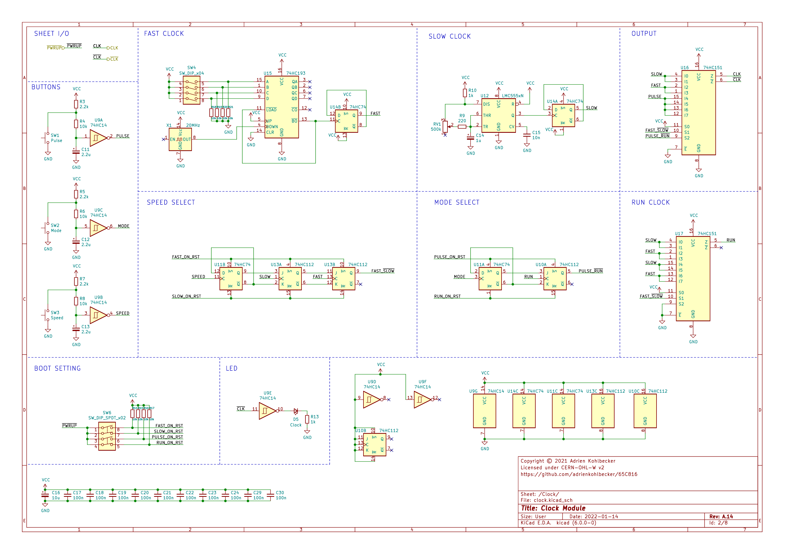
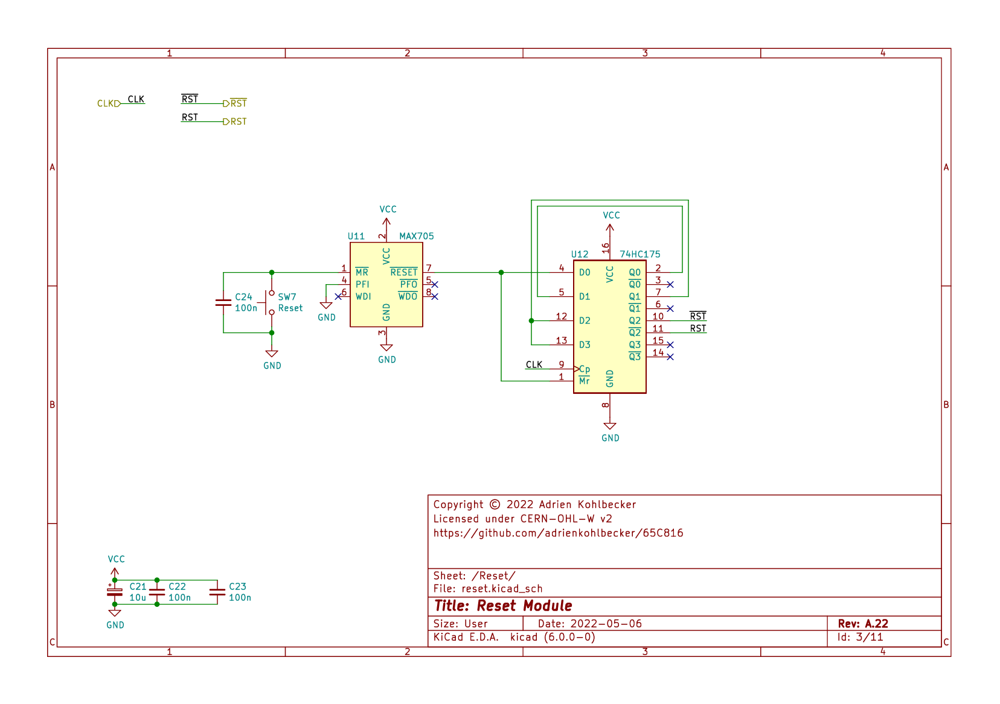
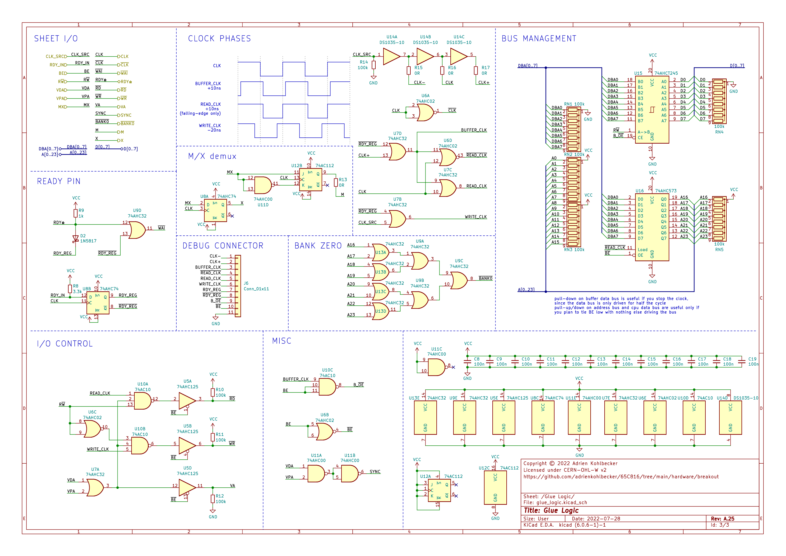

# 65C816

A homebrew computer based on the 65C816 processor. Watch the series on YouTube:

[](https://www.youtube.com/watch?v=sdFXc0Rkpvc&list=PLdGm_pyUmoII9D16mzw-XsJjHKi3f1kqT)

## Goals

The purpose of this project is to build a 65C816 development platform and learn about the CPU. Conceptually, it will be similar to WDC's [own development board](https://wdc65xx.com/Single-Board-Computers/w65c816sxb/).

I'm not going for ludicrous speed and features for revision A, here are the goals:

- Runs at 4Mhz
- Prototyped on a breadboard, through-hole ICs only, no programmable logic
- 32KB RAM, 32KB ROM, 512KB extended RAM
- 65C22 and 65C21 for peripheral I/O
- 65C51 for UART

The goals of the YouTube series are to provide a good description of all the design decisions, including going in-depth on timing, to be a more advanced complement to something like Ben Eater's 6502 series, as well as show more love to this cool CPU in the homebrew community.

## Schematic

### Top-level

[](./schematics/main.png)

### Clock module

[](./schematics/clock.png)

### Reset module

[](./schematics/reset.png)

### Glue Logic module

[](./schematics/glue.png)

### Address Decoding module

[](./schematics/address_decoding.png)

### Memory module

[](./schematics/memory.png)

### GPIO module

[](./schematics/gpio.png)

### Peripherals module

[](./schematics/peripherals.png)

### Debug module

[](./schematics/debug.png)

### Monitor module

[](./schematics/monitor.png)

### Tester module

[](./schematics/tester.png)

## BOM

### Basics

- BusBoard BB830 Breadboards
- Hook-Up Wire: [Recommended option](https://www.jameco.com/z/JMS9313-01D-Jameco-Valuepro-22-AWG-6-Color-Solid-Tinned-Copper-Hook-Up-Wire-Assortment-100-Feet_2183752.html)
- Male-to-Male Dupont Wires
- [Dupont Female Connectors](https://www.aliexpress.com/item/4001362869482.html). Use them to replace single connectors and group your cables by 2, 8...
- 10uF Polarized capacitors. Sprinkle one per power rail
- 3mm LEDs with built-in resistors ([Yellow](https://www.digikey.com/product-detail/en/WP710A10YD5V/754-1729-ND/3084212), [Red](https://www.digikey.com/product-detail/en/WP710A10ID5V/754-1721-ND/3084187), [Green](https://www.digikey.com/product-detail/en/WP710A10SGD5V/754-1724-ND/3084201))
- LED Bars with 8 LEDs, various colors ([Red version](https://www.aliexpress.com/item/32315190808.html)), with [9-pin bussed 1k resistors](https://nl.mouser.com/ProductDetail/Bourns/4609M-101-102LF?qs=nFt9sTYf7TDihA0IqmqOVw%3D%3D). I use 1k, 1.5k or 3.3k resistors depending on the color.
- ZIF socket for ROM: [Aries Electronics 28-526-10](https://mouser.com/ProductDetail/Aries-Electronics/28-526-10?qs=WZRMhwwaLl9nHDqf31PyaQ%3D%3D) + [28pin Wire-Wrap socket](https://mouser.com/ProductDetail/Mill-Max/123-43-628-41-001000?qs=IGgAdOvCTsSqORqiKCtp8w%3D%3D)

### KiCad components

**Component Count:** 172

| Refs | Qty | Component | Description |
| ----- | --- | ---- | ----------- |
| BAR1 | 1 | LED-Array-10-BGYR | BAR GRAPH 10 segment |
| BAR2, BAR3, BAR4 | 3 | Yellow | BAR GRAPH 8 segment |
| BAR5 | 1 | Green | BAR GRAPH 8 segment |
| BAR6, BAR7, BAR8 | 3 | Red | BAR GRAPH 8 segment |
| C1 | 1 | 220u | Polarized capacitor, small symbol |
| C2, C4, C21, C25, C35, C41, C45 | 7 | 10u | Polarized capacitor, small symbol |
| C3, C6, C10, C11, C12, C13, C14, C15, C16, C17, C18, C22, C23, C24, C26, C27, C28, C29, C30, C31, C32, C33, C34, C36, C37, C38, C39, C40, C42, C43, C44, C46, C47, C48, C49, C50, C51, C52, C53, C54 | 40 | 100n | Unpolarized capacitor, small symbol |
| C5 | 1 | 22u | Polarized capacitor, small symbol |
| C7, C8, C9 | 3 | 2.2u | Polarized capacitor, small symbol |
| C19 | 1 | 1u | Polarized capacitor, small symbol |
| C20 | 1 | 10n | Unpolarized capacitor, small symbol |
| D1 | 1 | POWER | Light emitting diode, small symbol |
| D2 | 1 | Clock | Light emitting diode, small symbol |
| D3 | 1 | 1N5817 | 20V 1A Schottky Barrier Rectifier Diode, DO-41 |
| DS1 | 1 | HD44780 | LCD 16x2 Alphanumeric , 8 bit parallel bus, 5V VDD |
| J1 | 1 | POWER | Generic connector, single row, 01x02, script generated (kicad-library-utils/schlib/autogen/connector/) |
| J2 | 1 | Tester | Generic connector, single row, 01x08, script generated (kicad-library-utils/schlib/autogen/connector/) |
| R1, R21, R23, R27, R37, R38, R39 | 7 | 1k | Resistor, small symbol |
| R2, R3, R4, R5, R6, R8, R10, R12, R13, R14, R15, R16, R17, R18, R19, R20, R26, R28, R29, R30, R31 | 21 | 10k | Resistor, small symbol |
| R7, R9, R11 | 3 | 2.2k | Resistor, small symbol |
| R22 | 1 | 220 | Resistor, small symbol |
| R24, R25 | 2 | 100 | Resistor, small symbol |
| R32 | 1 | 3.3k | Resistor, small symbol |
| R33, R34, R35, R36 | 4 | 6.8k | Resistor, small symbol |
| R40, R41 | 2 | 1.5k | Resistor, small symbol |
| RN1, RN2, RN3, RN4, RN5, RN10 | 6 | 10k | 8 resistor network, star topology, bussed resistors, small symbol |
| RN6, RN7, RN8 | 3 | 1k | 8 resistor network, star topology, bussed resistors, small symbol |
| RN9 | 1 | 3.3k | 8 resistor network, star topology, bussed resistors, small symbol |
| RN11, RN12, RN13 | 3 | 1.5k | 8 resistor network, star topology, bussed resistors, small symbol |
| RV1 | 1 | 500k | Potentiometer |
| RV2 | 1 | 10k | Potentiometer |
| SW1 | 1 | Pulse | Push button switch, generic, two pins |
| SW2 | 1 | Mode | Push button switch, generic, two pins |
| SW3 | 1 | Speed | Push button switch, generic, two pins |
| SW4 | 1 | SW_DIP_SPDT_x02 | 2x DIP Switch, Single Pole Double Throw (SPDT) switch, small symbol |
| SW5 | 1 | SW_DIP_x04 | 4x DIP Switch, Single Pole Single Throw (SPST) switch, small symbol |
| SW6 | 1 | SW_DIP_SPDT_x01 | 2x DIP Switch, Single Pole Double Throw (SPDT) switch, small symbol |
| SW7 | 1 | Reset | Push button switch, generic, two pins |
| SW8 | 1 | SW_DIP_x08 | 8x DIP Switch, Single Pole Single Throw (SPST) switch, small symbol |
| U1 | 1 | W65C816SxP | W65C816S 8/16-bit CMOS General Purpose Microprocessor, DIP-40 |
| U2 | 1 | 74HC14 | Hex inverter schmitt trigger |
| U3, U6 | 2 | 74HC74 | Dual D Flip-flop, Set & Reset |
| U4 | 1 | 74HC193 | Synchronous 4-bit Up/Down (2 clk) counter |
| U5, U7 | 2 | 74HC112 | dual JK Flip-Flop, Set & Reset |
| U8 | 1 | LMC555xN | CMOS Timer, 555 compatible, PDIP-8 |
| U9 | 1 | 74AC151 | Multiplexer 8 to 1 |
| U10 | 1 | 74HC151 | Multiplexer 8 to 1 |
| U11 | 1 | MAX705 | Low-Cost, μP Supervisory Circuit |
| U12 | 1 | 74HC175 | 4-bit D Flip-Flop, reset |
| U13 | 1 | 74AHC74 | Dual D Flip-flop, Set & Reset |
| U14 | 1 | 74AHC125 | Quad buffer 3-State outputs |
| U15 | 1 | DS1035-10 | 3-in-1 High–Speed Silicon Delay Line |
| U16 | 1 | 74AHC00 | quad 2-input NAND gate |
| U17 | 1 | 74AHC02 | quad 2-input NOR gate |
| U18, U25 | 2 | 74AHC32 | Quad 2-input OR |
| U19 | 1 | 74AC10 | Triple 3-input NAND |
| U20 | 1 | 74ACT245 | Octal BUS Transceivers, 3-State outputs |
| U21 | 1 | 74AC563 | 8-bit Latch 3-state outputs inverting |
| U22, U23 | 2 | 74HC30 | 8-input NAND |
| U24 | 1 | 74AHC00 | quad 2-input NAND gate |
| U26 | 1 | 74AHC138 | Decoder 3 to 8 active low outputs |
| U27 | 1 | AT28C256-15PC | Paged Parallel EEPROM 256Kb (32K x 8), DIP-28/SOIC-28 |
| U28 | 1 | LY62256PL-55LL | 32Kx8 bit Low Power CMOS Static RAM, 55/70ns, DIP-28 |
| U29 | 1 | AS6C4008-55PCN | 512K x 8 Low Power CMOS RAM, DIP-32 |
| U30 | 1 | 74HC04 | Hex Inverter |
| U31, U32 | 2 | 74HC540 | 8-bit Buffer/Line driver Inverter, 3-state outputs |
| U33, U34, U35, U38, U39 | 5 | 74HC541 | 8-bit Buffer/Line Driver 3-state outputs |
| U36 | 1 | Teensy++2.0 |  |
| U37 | 1 | W65C22SxP | W65C22S CMOS Versatile Interface Adapter (VIA), 20-pin I/O, 2 Timer/Counters, DIP-40 |
| X1 | 1 | 20MHz | Crystal Clock Oscillator, DIP14-style metal package |

### Used in previous videos

| Refs | Qty | Component | Description |
| ----- | --- | ---- | ----------- |
| U* | 1 | 74AC08 | Quad And2 |

### Replacement for obsolete chips

- `DS1035-10`: can be replaced by `DS1135Z-10+` with a SOIC-8 to through hole adapter
- `Teensy++ 2.0`: While it is not manufactured by PJRC anymore, clones of this board are available on sites such as Aliexpress

## Memory map

### Diagram

[](./doc/memory_map.png)

### Decoding

[](./doc/address_decoding.png)

## Timing diagrams

### Clock

<details><summary>View source</summary><p>

Uses [custom fork](https://github.com/adrienkohlbecker/wavedrom)

```js
{
  signal: [
    { name: 'CLK_IN', wave: '0..(25)x(10)1(40)x(10)0(17)', phase: 0.20 },
    { nodes: ['...(25)Ο(5)Ό(5)G(40)H(5)R(5)P', '...(30)Ν(10)Ά(40)Β(10)Ξ'], phase: 0.45 },
    { name: 'CLK-', wave: '0..(37.5)x(5)1(45)x(5)0..(7.5)', phase: 0.20 },
    { nodes: ['...(37.5)Ё(2.5)Ж(2.5)S(45)T(2.5)Ћ(2.5)Δ', '...(40)L(10)K(40)M(10)Σ'], phase: 0.45 },
    { name: 'CLK', wave: '1.0(50)1(50)0.', phase: 0.20 },
    { nodes: ['..Θ(10)Λ(40)Њ(10)Ќ', '...(7.5)Љ(2.5)Є(2.5)Υ(45)Ю(2.5)Ψ(2.5)Ω'], phase: 0.45 },
    { name: 'CLK+', wave: '1..(7.5)x(5)0(45)x(5)1..(37.5)', phase: 0.20 },
    {},
    { nodes: ['..Ε(8.5)Ι(41.5)Κ(8.5)Μ', '..Ρ(1)Τ(49)Χ(1)А'], phase: 0.45 },
    { name: '~CLK', wave: '0..(1)x(7.5)1(42.5)x(7.5)0..(41.5)', phase: 0.20 },
  ],
  edge: [
    'Ν+Ά 10ns', 'Β+Ξ 10ns', 'Ο+Ό 5ns', 'Ό+G 5ns', 'H+R 5ns', 'R+P 5ns',
    'L+K 10ns', 'M+Σ 10ns', 'Ё+Ж 2.5ns', 'Ж+S 2.5ns', 'T+Ћ 2.5ns', 'Ћ+Δ 2.5ns',
    'Θ+Λ 10ns', 'Њ+Ќ 10ns', 'Љ+Є 2.5ns', 'Є+Υ 2.5ns', 'Ю+Ψ 2.5ns', 'Ψ+Ω 2.5ns',
    'Ε+Ι 8.5ns', 'Κ+Μ 8.5ns', 'Ρ+Τ 1ns', 'Χ+А 1ns'
  ],
  config: {
    skin: 'narrower',
    lines: {
      offset: 2,
      every: 50
    },
    background: 'white',
  },
  head: {
    tick: -2,
    every: 10,
    text: ['tspan', { "font-size": '12px' }, 'based on 10Mhz clock']
  }
}
```
</p></details>

[](./timing/Timing%20Clock.png)

### DB/BA Latch

<details><summary>View source</summary><p>

Uses [custom fork](https://github.com/adrienkohlbecker/wavedrom)

```js
{
  signal: [
    { name: 'CLK', wave: '1.0(50)1(50)0.', phase: 0.20 },
    { nodes: ['..Ѳ(10)Ѵ(40)Ά(10)Β', '...(7.5)Α(2.5)Γ(2.5)Ν(45)Ξ(2.5)Ο(2.5)Ό'], phase: 0.45 },
    { name: 'CLK+', wave: '1..(7.5)x(5)0(45)x(5)1..(37.5)', phase: 0.20 },
    { nodes: ['..B(33)Π', '..A(10)D(40)E(10)F(30)G(10)H'], phase: 0.45 },
    { name: 'CPU D0-D7 (read)', wave: '6..(10)x(23)7(27)x(30)6..(10)', data: ['Read Data', 'Bank Address', 'Read Data'], phase: 0.20 },
    { nodes: ['..K(33)C(17)Σ(30)I', '..Ρ(10)L(23)C(17)M(10)N'], phase: 0.45 },
    { name: 'CPU D0-D7 (write)', wave: '6(12)x(23)7(27)x(20)6(22)', data: ['Write Data', 'Bank Address', 'Write Data'], phase: 0.20 },
    { nodes: ['...(12.5)Я(17)P(20.5)Τ(6.5)S', '...(7.5)J(2)O..(38.5)Q(1)R'], phase: 0.45 },
    { name: 'AC563 LE', wave: '0..(9.5)x(20)1(21.5)x(5.5)0(45.5)', node: '..(49.5)É(2.5)È.(4.5)À(2)Ç', phase: 0.20, nphase: 0.45, nyoffset: -6 },
    { nodes: ['..(34)Υ(11.5)Z'], phase: 0.45 },
    { nodes: ['...(33)X(2)Y', '...(9.5)T(2)U(18)V(11)W'], phase: 0.45 },
    { name: 'BA0-BA7', wave: '7..(11.5)x(33)7(57.5)', data: ['BA', 'Bank Address'], phase: 0.20 },
  ],
  edge: [
    'Ѳ+Ѵ 10ns', 'Α+Γ 2.5ns', 'Γ+Ν 2.5ns', 'Ά+Β 10ns', 'Ξ+Ο 2.5ns', 'Ο+Ό 2.5ns',
    'A+D 10ns', 'B+Π 33ns', 'E+F 10ns', 'G+H 10ns',
    'Ρ+L 10ns', 'K+C 33ns', 'M+N 10ns', 'Σ+I 30ns',
    'J+O 2ns', 'Я+P 17ns', 'Q+R 1ns', 'Τ+S 6.5ns (with a single load gate CL = 15 pF)',
    'T+U 2ns', 'V+W 11ns', 'X+Y 2ns', 'Υ+Z 11.5ns',
    'É+È 2.5ns', 'À+Ç 2ns',
  ],
  config: {
    skin: 'narrower',
    lines: {
      offset: 2,
      every: 50
    },
    background: 'white'
  },
  head: {
    tick: -2,
    every: 10,
    text: ['tspan', { "font-size": '12px' }, 'based on 10Mhz clock; assumes BE=RDY=1']
  }
}
```
</p></details>

[](./timing/Timing%20Latch.png)

### DB/BA Buffer

<details><summary>View source</summary><p>

Uses [custom fork](https://github.com/adrienkohlbecker/wavedrom)

```js
{
  signal: [
    { name: 'CLK', wave: '1.0(50)1(50)0.', phase: 0.20 },
    { nodes: ['..Ѳ(10)Ѵ(40)Ά(10)Β', '...(7.5)Α(2.5)Γ(2.5)Ν(45)Ξ(2.5)Ο(2.5)Ό'], phase: 0.45 },
    { name: 'CLK+', wave: '1..(7.5)x(5)0(45)x(5)1..(37.5)', phase: 0.20 },
    { nodes: ['..B(33)Π', '..A(10)D(40)E(10)F(30)G(10)H'], phase: 0.45 },
    { name: 'CPU D0-D7 (read)', wave: '6..(10)x(23)7(27)x(30)6..(10)', data: ['Read Data', 'Bank Address', 'Read Data'], phase: 0.20 },
    { nodes: ['..K(33)C(17)Σ(30)I', '..Ρ(10)L(23)C(17)M(10)N'], phase: 0.45 },
    { name: 'CPU D0-D7 (write)', wave: '6(12)x(23)7(27)x(20)6(22)', data: ['Write Data', 'Bank Address', 'Write Data'], phase: 0.20 },
    { nodes: ['..Ύ(30)Д', '..Б(10)Г'], phase: 0.45 },
    { name: 'ACT245 DIR', wave: '3..(10)x(20)3(70)..', data: ['RWB', 'RWB'], phase: 0.20 },
    { node: '...(10)Ё(1)Ж(19)З(12)И', phase: 0.45 },
    { name: 'ACT245 OUT', wave: '2..(11)x(31)2(58)..', data: ['DIR valid', 'DIR valid'], phase: 0.20 },
    { nodes: ['...(11)(2.5)І(16.5)Л(22)(11)(2.5)Ѣ(15)Ц', '...(7.5)Й(2)К(41.5)(7.5)П(2)Ф'], phase: 0.45 },
    { name: 'ACT245 OE', wave: '0..(9.5)x(19.5)1(30.5)x(18)0(22.5)..', data: ['RWB', 'RWB'], phase: 0.20 },
    { node: '...(9.5)Ч(1)Ш(18.5)Щ(11)Ъ(19.5)Ы(1.5)Ь(16.5)Э(12)Ю', phase: 0.45 },
    { name: 'ACT245 OUT', wave: '2..(10.5)x(29.5)2(21)x(28.5)2(10.5)..', data: ['ON', 'OFF', 'ON'], phase: 0.20 },
    { nodes: ['..Ε(10)Δ', '..(10)Φ(1)Έ(71)Ζ(9)Η(10)Ή'], phase: 0.45 },
    { name: 'D0-D7 (read)', wave: '6..(9)x(72)6(19)..', data: ['Read Data', 'Read Data'], phase: 0.20 },
    { node: '..Θ(10)Ι(1)Ί(39)Κ(30)Λ(9)Μ', phase: 0.45 },
    { name: 'D0-D7 (write)', wave: '6..(11)x(78)6(11)..', data: ['Write Data', 'Write Data'], phase: 0.20 },
  ],
  edge: [
    'Ѳ+Ѵ 10ns', 'Α+Γ 2.5ns', 'Γ+Ν 2.5ns', 'Ά+Β 10ns', 'Ξ+Ο 2.5ns', 'Ο+Ό 2.5ns',
    'A+D 10ns', 'B+Π 33ns', 'E+F 10ns', 'G+H 10ns',
    'Ρ+L 10ns', 'K+C 33ns', 'M+N 10ns', 'Σ+I 30ns',
    'Б+Г 10ns', 'Ύ+Д 30ns',
    'Ё+Ж 1ns', 'З+И 12ns',
    'Й+К 2ns', 'І+Л 16.5ns', 'П+Ф 2ns', 'Ѣ+Ц 15ns',
    'Ч+Ш 1ns', 'Щ+Ъ 11ns', 'Ы+Ь 1.5ns', 'Э+Ю 12ns',
    'Ε+Δ 10ns', 'Φ+Έ 1ns', 'Ζ+Η 9ns', 'Η+Ή 10ns',
    'Θ+Ι 10ns', 'Ι+Ί 1ns', 'Κ+Λ 30ns', 'Λ+Μ 9ns'
  ],
  config: {
    skin: 'narrower',
    lines: {
      offset: 2,
      every: 50
    },
    background: 'white'
  },
  head: {
    tick: -2,
    every: 10,
    text: ['tspan', { "font-size": '12px' }, 'based on 10Mhz clock; assumes BE=RDY=1']
  }
}
```
</p></details>

[](./timing/Timing%20Buffer.png)

### Address decoding

<details><summary>View source</summary><p>

Uses [custom fork](https://github.com/adrienkohlbecker/wavedrom)

```js
{
  signal: [
    { name: 'CLK', wave: '1.0(100)1.', phase: 0.20 },
    { nodes: ['..Ѳ(30)Ѵ', '..Α(10)Γ'], phase: 0.45 },
    { name: 'A[0..15]', wave: '3..(10)x(20)3(70)..', data: ['', 'Address'], phase: 0.20 },
    { nodes: ['..Β(44.5)Ξ', '..Ν(11.5)Ά'], phase: 0.45 },
    { name: 'A[16..23]', wave: '7..(11.5)x(33)7(57.5)', data: ['', 'Bank Address'], phase: 0.20 },
    { nodes: ['..Ο(70)Ό', '..A(12.5)D'], phase: 0.45 },
    { name: 'EXTRAM_CS', wave: '8..(12.5)x(57.5)8(32)', data: ['', 'Extended RAM'], phase: 0.20 },
    { nodes: ['..B(76)Π', '..E(12)F'], phase: 0.45 },
    { name: 'ROM_CS', wave: '8..(12)x(64)8(26)', data: ['', 'ROM'], phase: 0.20 },
    { nodes: ['..G(79)H', '..Ρ(11)L'], phase: 0.45 },
    { name: 'IO_CS', wave: '8..(11)x(68)8(23)', data: ['', 'I/O'], phase: 0.20 },
    { nodes: ['..K(76)C', '..M(12)N'], phase: 0.45 },
    { name: 'RAM_CS', wave: '8..(12)x(64)8(26)', data: ['', 'RAM'], phase: 0.20 },
  ],
  edge: [
    'Ѳ+Ѵ 30ns', 'Α+Γ 10ns', 'Ν+Ά 11.5ns', 'Β+Ξ 44.5ns', 'Ο+Ό 70ns',
    'A+D 12.5ns', 'B+Π 76ns', 'E+F 12ns', 'G+H 79ns',
    'Ρ+L 11ns', 'K+C 76ns', 'M+N 12ns',
  ],
  config: {
    skin: 'narrower',
    lines: {
      offset: 2,
      every: 100
    },
    background: 'white'
  },
  head: {
    tick: -2,
    every: 10,
    text: ['tspan', { "font-size": '12px' }, 'based on 5Mhz clock; assumes BE=RDY=1']
  }
}
```
</p></details>

[](./timing/Timing%20Address.png)

### Bus Enable

<details><summary>View source</summary><p>

Uses [custom fork](https://github.com/adrienkohlbecker/wavedrom)

```js
{
  signal: [
    { name: 'BE', wave: '1....0(40)1(40)0(2)', phase: 0.20 },
    { nodes: ['.....Ѳ(25)Ѵ(15)Ρ(25)L'], phase: 0.45 },
    { name: 'CPU ADDR & RWB', wave: '7....x(25)9(15)x(25)7(15)x(2)', data:['ON', 'OFF', 'ON'], phase: 0.20 },
    { nodes: ['.....Ά(8.5)Ν(31.5)M(8.5)N', '.....Α(1)Γ(39)K(1)C'], phase: 0.45 },
    { name: '!BE', wave: '0.....(1)x(7.5)1(32.5)x(7.5)0(32.5)x(1)', phase: 0.20 },
    { nodes: ['......(8.5)Β(12)Ξ(28)J(10)O', '......(1)Ο(1.5)Ό(38.5)Σ(2)I'], phase: 0.45 },
    { name: 'AC563 OUT', wave: '7.....(2.5)x(18)9(22.5)x(15.5)7(23.5)', data:['ON', 'OFF', 'ON'], phase: 0.20 },
    { nodes: ['.....A(8.5)D(31.5)Q(8.5)R', '.....B(1)Π(39)Я(1)P'], phase: 0.45 },
    { name: 'ACT245 OE', wave: '0.....(1)x(7.5)1(32.5)x(7.5)0(32.5)x(1)', phase: 0.20 },
    { nodes: ['......(8.5)E(11)F(29)T(12)U', '......(1)G(1)H(39)Τ(1.5)S'], phase: 0.45 },
    { name: 'ACT245 OUT', wave: '7.....(2)x(17.5)9(23)x(18)7(21.5)', data:['ON', 'OFF', 'ON'], phase: 0.20 },
    { nodes: ['......(8.5)V(10)W(30)Б(8)Г', '......(1)X(1)Y(39)Ύ(1)Д'], phase: 0.45 },
    { name: 'RD & WR', wave: '7.....(2)x(16.5)9(23.5)x(14.5)7(25.5)', data:['ON', 'OFF', 'ON'], phase: 0.20 },
  ],
  edge: [
    'Ѳ+Ѵ 25ns', 'Α+Γ 1ns', 'Ά+Ν 8.5ns', 'Ο+Ό 1.5ns', 'Ξ+Β 12ns',
    'B+Π 1ns', 'A+D 8.5ns', 'G+H 1ns','E+F 11ns',
    'Ρ+L 25ns', 'K+C 1ns', 'M+N 8.5ns', 'Σ+I 2ns', 'J+O 10ns',
    'Я+P 1ns', 'Q+R 8.5ns', 'Τ+S 1.5ns','T+U 12ns',
    'V+W 10ns', 'X+Y 1ns', 'Б+Г 8ns', 'Ύ+Д 1ns',
  ],
  config: {
    skin: 'narrower',
    lines: {
      offset: 5,
      every: 40
    },
    background: 'white'
  },
  head: {
    tick: -5,
    every: 10,
    text: ['tspan', { "font-size": '12px', dx: 20 }, 'timing of Bus Enable; assumes CLK=RDY=1']
  }
}
```
</p></details>

[](./timing/Timing%20BE.png)

### RDY

<details><summary>View source</summary><p>

Uses [custom fork](https://github.com/adrienkohlbecker/wavedrom)

```js
{
  signal: [
    { name: 'CLK_IN', wave: '0..(100)x(10)1(115)x(10)0(17)', phase: 0.20 },
    { nodes: ['...(100)Ο(5)Ό(5)G(115)H(5)R(5)P', '...(105)Ν(10)Ά(115)Β(10)Ξ'], phase: 0.9 },
    { name: 'CLK-', wave: '0..(112.5)x(5)1(120)x(5)0..(7.5)', phase: 0.20 },
    { nodes: ['...(112.5)Ё(2.5)Ж(2.5)S(120)T(2.5)Ћ(2.5)Δ', '...(115)L(10)K(115)M(10)Σ'], phase: 0.9 },
    { name: 'CLK', wave: '1.0(125)1(125)0.', phase: 0.20 },
    { nodes: ['..Θ(10)Λ(115)Њ(10)Ќ', '...(7.5)Љ(2.5)Є(2.5)Υ(120)Ю(2.5)Ψ(2.5)Ω'], phase: 0.9 },
    { name: 'CLK+', wave: '1..(7.5)x(5)0(120)x(5)1..(112.5)', phase: 0.20 },
    {},
    { nodes: ['..Ε(8.5)Ι(116.5)Κ(8.5)Μ', '..Ρ(1)Τ(124)Χ(1)А'], phase: 0.9 },
    { name: '~CLK', wave: '0..(1)x(7.5)1(117.5)x(7.5)0..(115.5)x', phase: 0.20 },
  ],
  edge: [
    'Ν+Ά 10ns', 'Β+Ξ 10ns', 'Ο+Ό 5ns', 'Ό+G 5ns', 'H+R 5ns', 'R+P 5ns',
    'L+K 10ns', 'M+Σ 10ns', 'Ё+Ж 2.5ns', 'Ж+S 2.5ns', 'T+Ћ 2.5ns', 'Ћ+Δ 2.5ns',
    'Θ+Λ 10ns', 'Њ+Ќ 10ns', 'Љ+Є 2.5ns', 'Є+Υ 2.5ns', 'Ю+Ψ 2.5ns', 'Ψ+Ω 2.5ns',
    'Ε+Ι 8.5ns', 'Κ+Μ 8.5ns', 'Ρ+Τ 1ns', 'Χ+А 1ns'
  ],
  config: {
    skin: 'narrowerer',
    lines: {
      offset: 2,
      every: 125,
      every_muted: 10,
    },
    background: 'white',
  },
  head: {
    tick: -2,
    every: 10,
    text: ['tspan', { "font-size": '12px' }, 'based on 4Mhz clock']
  }
}
```
</p></details>

[](./timing/Timing%20RDY.png)

### ROM

<details><summary>View source</summary><p>

Uses [custom fork](https://github.com/adrienkohlbecker/wavedrom)

```js
{
  signal: [
    { name: 'CLK', wave: '1.0(125)1(125)0.', phase: 0.20 },
    { nodes: ['..C(10)D(115)L(10)M', '...(7.5)I(2.5)J(2.5)K(120)N(2.5)O(2.5)Z'], phase: 0.9 },
    { name: 'CLK+', wave: '1..(7.5)x(5)0(120)x(5)1..(112.5)', phase: 0.20 },
    { nodes: ['..Ύ(30)Д', '..Б(10)Г'], phase: 0.9 },
    { name: 'A0..15, RWB', wave: '3..(10)x(20)3(220)..', data: ['', 'ADDRESS, RWB'], phase: 0.20 },
    { nodes: ['..Φ(9)Έ(222)Ζ(19)Η'], phase: 0.9 },
    { name: 'READ BUFFER', wave: '6..(9)x(222)6(19)..', data: ['', 'Reading Data'], phase: 0.20 },
    { nodes: ['...(12.5)Ѳ(33.5)Ѵ(79)V(23.5)W', '...(7.5)Α(4)Γ(113.5)T(3)U'], phase: 0.9 },
    { name: 'RD', wave: '0..(11.5)x(34.5)1(82)x(20.5)0(103.5)', data: ['', 'ROM'], phase: 0.20 },
    { nodes: ['..B(76)Π', '..E(12)F'], phase: 0.9 },
    { name: 'ROM_CS', wave: '0..(12)x(64)0(176)', data: ['', 'ROM'], phase: 0.20 },
    { nodes: ['', '...(30)Ο(150)Ό'], phase: 0.9 },
    { nodes: ['...(10)Q(0)S(66)Β(150)Ξ', '..G(10)R(36)H(50)P(52.5)Ν(70)Ά'], phase: 0.9 },
    { name: 'ROM DATA', wave: '5..(10)x(86)z(32)x(98)5(26)', data: ['', 'OUTPUT VALID'], phase: 0.20 },
  ],
  edge: [
    'Б+Г 10ns', 'Ύ+Д 30ns',
    'Φ+Έ 9ns', 'Ζ+Η 19ns',
    'B+Π 76ns', 'E+F 12ns',
    'Ѳ+Ѵ 33.5ns', 'Α+Γ 4ns', 'T+U 3ns', 'V+W 23.5ns',
    'Ν+Ά 70ns (tOE)', 'Β+Ξ 150ns (tCE)', 'Ο+Ό 150ns (tAcc)', 'G+R 10ns', 'H+P 50ns (tDF)',
    'Q+S 0ns (tOH)',
    'C+D 10ns', 'I+J 2.5ns', 'J+K 2.5ns', 'L+M 10ns', 'N+O 2.5ns', 'O+Z 2.5ns',
  ],
  config: {
    skin: 'narrowerer',
    lines: {
      offset: 2,
      every: 125
    },
    background: 'white',
  },
  head: {
    tick: -2,
    every: 10,
    text: ['tspan', { "font-size": '12px' }, 'based on 4Mhz clock; assumes BE=RDY=1']
  }
}
```
</p></details>

[](./timing/Timing%20ROM.png)

### RAM

#### Read Cycle

<details><summary>View source</summary><p>

Uses [custom fork](https://github.com/adrienkohlbecker/wavedrom)

```js
{
  signal: [
    { name: 'CLK', wave: '1.0(125)1(125)0.', phase: 0.20 },
    { nodes: ['..C(10)D(115)Q(10)U', '...(7.5)I(2.5)J(2.5)A(120)N(2.5)O(2.5)Z'], phase: 0.9 },
    { name: 'CLK+', wave: '1..(7.5)x(5)0(120)x(5)1..(112.5)', phase: 0.20 },
    { nodes: ['..Ύ(30)Д', '..Б(10)Г'], phase: 0.9 },
    { name: 'A0..15, RWB', wave: '3..(10)x(20)3(220)..', data: ['', 'ADDRESS, RWB'], phase: 0.20 },
    { nodes: ['..Φ(9)Έ(222)Ζ(19)Η'], phase: 0.9 },
    { name: 'READ BUFFER', wave: '6..(9)x(222)6(19)..', data: ['', 'Reading Data'], phase: 0.20 },
    { nodes: ['...(12.5)Ѳ(33.5)Ѵ(79)V(23.5)W', '...(7.5)Α(4)Γ(113.5)X(3)Y'], phase: 0.9 },
    { name: 'RD', wave: '0..(11.5)x(34.5)1(82)x(20.5)0(103.5)', data: ['', 'ROM'], phase: 0.20 },
    { nodes: ['..B(76)Π', '..E(12)F'], phase: 0.9 },
    { name: 'RAM_CS', wave: '0..(12)x(64)0(176)', data: ['', 'ROM'], phase: 0.20 },
    { nodes: ['', '...(12)M(10)Σ(8)Ο(55)Ό'], phase: 0.9 },
    { nodes: ['...(10)S(10)T(26)R(20)P(10)Β(55)Ξ', '..G(11.5)H(64.5)L(20)K(32)Ё(5)Ж(15.5)Ν(30)Ά'], phase: 0.9 },
    { name: 'RAM DATA', wave: '5..(11.5)x(54.5)z(67)x(45.5)5(73.5)', data: ['', 'OUTPUT VALID'], phase: 0.20 },
    { nodes: ['', ''], phase: 0.9 },
  ],
  edge: [
    'Б+Г 10ns', 'Ύ+Д 30ns',
    'Φ+Έ 9ns', 'Ζ+Η 19ns',
    'B+Π 76ns', 'E+F 12ns',
    'Ѳ+Ѵ 33.5ns', 'Α+Γ 4ns', 'V+W 23.5ns', 'X+Y 3ns',
    'Ν+Ά 30ns (tOE)',
    'Β+Ξ 55ns (tACE)',
    'Ο+Ό 55ns (tAA)',
    'G+H 11.5ns',
    'R+P 20ns (tOHZ)', 'L+K 20ns (tCHZ)',
    'M+Σ 10ns (tCLZ)', 'Ё+Ж 5ns (tOLZ)',
    'S+T 10ns (tOH)',
    'C+D 10ns', 'I+J 2.5ns', 'J+A 2.5ns', 'Q+U 10ns', 'N+O 2.5ns', 'O+Z 2.5ns',
  ],
  config: {
    skin: 'narrowerer',
    lines: {
      offset: 2,
      every: 125
    },
    background: 'white',
  },
  head: {
    tick: -2,
    every: 10,
    text: ['tspan', { "font-size": '12px' }, 'based on 4Mhz clock; assumes BE=RDY=1']
  }
}
```
</p></details>

[](./timing/Timing%20RAM%20Read.png)

#### Write Cycle

<details><summary>View source</summary><p>

Uses [custom fork](https://github.com/adrienkohlbecker/wavedrom)

```js
{
  signal: [
    { name: 'CLK', wave: '1.0(125)1(125)0.', phase: 0.20 },
    { nodes: ['...(105)Λ(20)T(105)Y(20)Ы', '...(100)W(5)X(5)A(115)Δ(5)O(5)Z'], phase: 0.9 },
    { name: 'CLK_IN', wave: '0..(100)x(10)1(115)x(10)0(17)', phase: 0.20 },
    { nodes: ['..Ύ(30)Д', '..Б(10)Г'], phase: 0.9 },
    { name: 'A0..15, RWB', wave: '3..(10)x(20)3(220)..', data: ['', 'ADDRESS, RWB'], phase: 0.20 },
    { nodes: ['..Φ(10.5)Έ(114.5)Ζ(39.5)Η'], phase: 0.9 },
    { name: 'WRITE BUFFER', wave: '6..(10.5)x(154)6(85.5)..', data: ['', 'Writing Data'], phase: 0.20 },
    { nodes: ['..B(76)Π', '..E(12)F'], phase: 0.9 },
    { name: 'RAM_CS', wave: '0..(12)x(64)0(176)', data: ['', 'ROM'], phase: 0.20 },
    { nodes: ['...(30)U(55)V', '...(30)Ο(50)Ό'], phase: 0.9 },
    { nodes: ['...(76)Β(50)Ξ', '...(10)P(0)Q(93)I(0)J(30.5)M(45)N',], phase: 0.9 },
    { nodes: ['', 'Ѳ(12)Ѵ(90)Α(3)Γ(7)R(23.5)S(91.5)C(3)D(7)Ψ(17)Ω'], phase: 0.9 },
    { name: 'WR', wave: 'x..(10)1(93)x(30.5)0(94.5)x(24)', data: ['', 'ROM'], phase: 0.20 },
    { nodes: ['...(10)G(0)H(193)L(25)K'], phase: 0.9 },
    { name: 'RAM DATA', wave: '5..(10)z(193)5(49)', data: ['', 'DATA VALID'], phase: 0.20 },
  ],
  edge: [
    'Б+Г 10ns', 'Ύ+Д 30ns',
    'Φ+Έ 10.5ns', 'Ζ+Η 39.5ns',
    'B+Π 76ns', 'E+F 12ns',
    'Ѳ+Ѵ 25ns', 'Α+Γ 3ns',
    'Β+Ξ 50ns (tCW)', 'Ο+Ό 50ns (tAW)',
    'G+H 0ns (tDH)','L+K 25ns (tDW)', 'Ч+Ш 25ns (tDW)',
    'I+J 0ns (tAS)', 'M+N 45ns (tWP)', 'P+Q 0ns (tWR)',
    'U+V 55ns (tWC)', 'C+D 3ns', 'R+S 23.5ns', 'Ψ+Ω 25ns', 'Α+Γ 3ns', 'Ѳ+Ѵ 25ns',
    'Λ+T 20ns', 'W+X 5ns', 'X+A 5ns', 'Y+Ы 20ns', 'Δ+O 5ns', 'O+Z 5ns',
  ],
  config: {
    skin: 'narrowerer',
    lines: {
      offset: 2,
      every: 125
    },
    background: 'white',
  },
  head: {
    tick: -2,
    every: 10,
    text: ['tspan', { "font-size": '12px' }, 'based on 4Mhz clock; assumes BE=RDY=1']
  }
}
```
</p></details>

[](./timing/Timing%20RAM%20Write.png)

### Extended RAM

#### Read Cycle

<details><summary>View source</summary><p>

Uses [custom fork](https://github.com/adrienkohlbecker/wavedrom)

```js
{
  signal: [
    { name: 'CLK', wave: '1.0(125)1(125)0.', phase: 0.20 },
    { nodes: ['..C(10)D(115)Q(10)U', '...(7.5)I(2.5)J(2.5)A(120)N(2.5)O(2.5)Z'], phase: 0.9 },
    { name: 'CLK+', wave: '1..(7.5)x(5)0(120)x(5)1..(112.5)', phase: 0.20 },
    { nodes: ['..Ύ(30)Д', '..Б(10)Г'], phase: 0.9 },
    { name: 'A0..15, RWB', wave: '3..(10)x(20)3(220)..', data: ['', 'ADDRESS, RWB'], phase: 0.20 },
    { nodes: ['..Φ(9)Έ(222)Ζ(19)Η'], phase: 0.9 },
    { name: 'READ BUFFER', wave: '6..(9)x(222)6(19)..', data: ['', 'Reading Data'], phase: 0.20 },
    { nodes: ['...(12.5)Ѳ(33.5)Ѵ(79)V(23.5)W', '...(7.5)Α(4)Γ(113.5)X(3)Y'], phase: 0.9 },
    { name: 'RD', wave: '0..(11.5)x(34.5)1(82)x(20.5)0(103.5)', data: ['', 'ROM'], phase: 0.20 },
    { nodes: ['..B(70)Π', '..E(12.5)F'], phase: 0.9 },
    { name: 'RAM_CS', wave: '0..(12.5)x(57.5)0(176)', data: ['', 'ROM'], phase: 0.20 },
    { nodes: ['', '...(12.5)M(10)Σ(7.5)Ο(55)Ό'], phase: 0.9 },
    { nodes: ['...(10)S(10)T(26)R(20)P(4)Β(55)Ξ', '..G(11.5)H(58.5)L(20)K(38)Ё(5)Ж(15.5)Ν(30)Ά'], phase: 0.9 },
    { name: 'EXTRAM DATA', wave: '5..(11.5)x(54.5)z(67)x(45.5)5(73.5)', data: ['', 'OUTPUT VALID'], phase: 0.20 },
    { nodes: ['', ''], phase: 0.9 },
  ],
  edge: [
    'Б+Г 10ns', 'Ύ+Д 30ns',
    'Φ+Έ 9ns', 'Ζ+Η 19ns',
    'B+Π 70ns', 'E+F 12.5ns',
    'Ѳ+Ѵ 33.5ns', 'Α+Γ 4ns', 'V+W 23.5ns', 'X+Y 3ns',
    'Ν+Ά 30ns (tOE)',
    'Β+Ξ 55ns (tACE)',
    'Ο+Ό 55ns (tAA)',
    'G+H 11.5ns',
    'R+P 20ns (tOHZ)', 'L+K 20ns (tCHZ)',
    'M+Σ 10ns (tCLZ)', 'Ё+Ж 5ns (tOLZ)',
    'S+T 10ns (tOH)',
    'C+D 10ns', 'I+J 2.5ns', 'J+A 2.5ns', 'Q+U 10ns', 'N+O 2.5ns', 'O+Z 2.5ns',
  ],
  config: {
    skin: 'narrowerer',
    lines: {
      offset: 2,
      every: 125
    },
    background: 'white',
  },
  head: {
    tick: -2,
    every: 10,
    text: ['tspan', { "font-size": '12px' }, 'based on 4Mhz clock; assumes BE=RDY=1']
  }
}
```
</p></details>

[](./timing/Timing%20EXTRAM%20Read.png)

#### Write Cycle

<details><summary>View source</summary><p>

Uses [custom fork](https://github.com/adrienkohlbecker/wavedrom)

```js
{
  signal: [
    { name: 'CLK', wave: '1.0(125)1(125)0.', phase: 0.20 },
    { nodes: ['...(105)Λ(20)T(105)Y(20)Ы', '...(100)W(5)X(5)A(115)Δ(5)O(5)Z'], phase: 0.9 },
    { name: 'CLK_IN', wave: '0..(100)x(10)1(115)x(10)0(17)', phase: 0.20 },
    { nodes: ['..Ύ(30)Д', '..Б(10)Г'], phase: 0.9 },
    { name: 'A0..15, RWB', wave: '3..(10)x(20)3(220)..', data: ['', 'ADDRESS, RWB'], phase: 0.20 },
    { nodes: ['..Φ(10.5)Έ(114.5)Ζ(39.5)Η'], phase: 0.9 },
    { name: 'WRITE BUFFER', wave: '6..(10.5)x(154)6(85.5)..', data: ['', 'Writing Data'], phase: 0.20 },
    { nodes: ['..B(70)Π', '..E(12.5)F'], phase: 0.9 },
    { name: 'RAM_CS', wave: '0..(12.5)x(57.5)0(182)', data: ['', 'ROM'], phase: 0.20 },
    { nodes: ['...(30)U(55)V', '...(30)Ο(50)Ό'], phase: 0.9 },
    { nodes: ['...(70)Β(50)Ξ', '...(10)P(0)Q(93)I(0)J(30.5)M(45)N',], phase: 0.9 },
    { nodes: ['', 'Ѳ(12)Ѵ(90)Α(3)Γ(7)R(23.5)S(91.5)C(3)D(7)Ψ(17)Ω'], phase: 0.9 },
    { name: 'WR', wave: 'x..(10)1(93)x(30.5)0(94.5)x(24)', data: ['', 'ROM'], phase: 0.20 },
    { nodes: ['...(10)G(0)H(193)L(25)K'], phase: 0.9 },
    { name: 'EXTRAM DATA', wave: '5..(10)z(193)5(49)', data: ['', 'DATA VALID'], phase: 0.20 },
  ],
  edge: [
    'Б+Г 10ns', 'Ύ+Д 30ns',
    'Φ+Έ 10.5ns', 'Ζ+Η 39.5ns',
    'B+Π 70ns', 'E+F 12.5s',
    'Β+Ξ 50ns (tCW)', 'Ο+Ό 50ns (tAW)',
    'G+H 0ns (tDH)','L+K 25ns (tDW)', 'Ч+Ш 25ns (tDW)',
    'I+J 0ns (tAS)', 'M+N 45ns (tWP)', 'P+Q 0ns (tWR)',
    'U+V 55ns (tWC)', 'C+D 3ns', 'R+S 23.5ns', 'Ψ+Ω 25ns', 'Α+Γ 3ns', 'Ѳ+Ѵ 25ns',
    'Λ+T 20ns', 'W+X 5ns', 'X+A 5ns', 'Y+Ы 20ns', 'Δ+O 5ns', 'O+Z 5ns',
  ],
  config: {
    skin: 'narrowerer',
    lines: {
      offset: 2,
      every: 125
    },
    background: 'white',
  },
  head: {
    tick: -2,
    every: 10,
    text: ['tspan', { "font-size": '12px' }, 'based on 4Mhz clock; assumes BE=RDY=1']
  }
}
```
</p></details>

[](./timing/Timing%20EXTRAM%20Write.png)

### 65C22 VIA

#### Read Cycle

<details><summary>View source</summary><p>

Uses [custom fork](https://github.com/adrienkohlbecker/wavedrom)

```js
{
  signal: [
    { name: 'CLK', wave: '1.0(125)1(125)0.', phase: 0.20 },
    {},
    { nodes: ['..Ύ(30)Д', '..Б(10)Г'], phase: 0.9 },
    { name: 'A0..15, RWB', wave: '3..(10)x(20)3(220)..', data: ['', 'ADDRESS, RWB'], phase: 0.20 },
    { nodes: ['..W(47)X', '..Λ(12)T'], phase: 0.9 },
    { name: 'VA', wave: '1..(12)x(35)1(205)', data: ['', 'ROM'], phase: 0.20 },
    { nodes: ['..B(79)Π', '..E(11)F'], phase: 0.9 },
    { name: 'IO0_CS', wave: '0..(11)x(68)0(173)', data: ['', 'ROM'], phase: 0.20 },
    { nodes: ['..U(10)V(105)Ο(10)Ό'], phase: 0.9 },
    { name: 'VIA CONTROL VALID', wave: '5..(10)z(105)5(137)', data: ['', 'CONTROL'], phase: 0.20 },
    {},
    { nodes: ['...(115)Β(10)Ξ'], phase: 0.9 },
    { name: 'PERIPH. DATA VALID', wave: 'z..(115)4(137)', data: ['PERIPHERAL DATA'], phase: 0.20 },
    { nodes: ['..G(10)H(115)L(20)K'], phase: 0.9 },
    { name: 'VIA DATA BUS', wave: '5..(10)x(135)5(107)', data: ['', 'DATA'], phase: 0.20 },
    { nodes: ['..Φ(9)Έ(222)Ζ(19)Η'], phase: 0.9 },
    { name: 'CPU READ BUFFER', wave: '6..(9)x(222)6(19)..', data: ['', 'Reading Data'], phase: 0.20 },
  ],
  edge: [
    'Б+Г 10ns', 'Ύ+Д 30ns',
    'Φ+Έ 9ns', 'Ζ+Η 19ns',
    'B+Π 79ns', 'E+F 11s',
    'G+H 10ns (tHR)','L+K 20ns (tCDR)',
    'U+V 10ns (tACR)', 'Ο+Ό 10ns (tCAR)',
    'Λ+T 12ns', 'W+X 47ns',
    'Β+Ξ 10ns (tPCR)',
  ],
  config: {
    skin: 'narrowerer',
    lines: {
      offset: 2,
      every: 125
    },
    background: 'white',
  },
  head: {
    tick: -2,
    every: 10,
    text: ['tspan', { "font-size": '12px' }, 'based on 4Mhz clock; assumes BE=RDY=1']
  }
}
```
</p></details>

[](./timing/Timing%20VIA%20Read.png)

#### Write Cycle

<details><summary>View source</summary><p>

Uses [custom fork](https://github.com/adrienkohlbecker/wavedrom)

```js
{
  signal: [
    { name: 'CLK', wave: '1.0(125)1(125)0.', phase: 0.20 },
    {},
    { nodes: ['..Ύ(30)Д', '..Б(10)Г'], phase: 0.9 },
    { name: 'A0..15, RWB', wave: '3..(10)x(20)3(220)..', data: ['', 'ADDRESS, RWB'], phase: 0.20 },
    { nodes: ['..W(47)X', '..Λ(12)T'], phase: 0.9 },
    { name: 'VA', wave: '1..(12)x(35)1(205)', data: ['', 'ROM'], phase: 0.20 },
    { nodes: ['..B(79)Π', '..E(11)F'], phase: 0.9 },
    { name: 'IO0_CS', wave: '0..(11)x(68)0(173)', data: ['', 'ROM'], phase: 0.20 },
    { nodes: ['..U(10)V(105)Ο(10)Ό'], phase: 0.9 },
    { name: 'VIA CONTROL VALID', wave: '5..(10)z(105)5(137)', data: ['', 'CONTROL'], phase: 0.20 },
    {},
    { nodes: ['..Φ(10.5)Έ(114.5)Ζ(39.5)Η'], phase: 0.9 },
    { name: 'CPU WRITE BUFFER', wave: '6..(10.5)x(154)6(85.5)..', data: ['', 'Writing Data'], phase: 0.20 },
    { nodes: ['..G(10)H(230)L(10)K'], phase: 0.9 },
    { name: 'VIA DATA BUS VALID', wave: '5..(10)z(230)5(12)', data: ['', 'DATA'], phase: 0.20 },
    { nodes: ['..Β(30)Ξ'], phase: 0.9 },
    { name: 'PERIPHERAL DATA', wave: 'x..(30)4(222)', data: ['PERIPHERAL DATA'], phase: 0.20 },
  ],
  edge: [
    'Б+Г 10ns', 'Ύ+Д 30ns',
    'Φ+Έ 10.5ns', 'Ζ+Η 39.5ns',
    'B+Π 79ns', 'E+F 11s',
    'G+H 10ns (tHW)','L+K 10ns (tDCW)',
    'U+V 10ns (tACW)', 'Ο+Ό 10ns (tCAW)',
    'Λ+T 12ns', 'W+X 47ns',
    'Β+Ξ 30ns (tCPW)',
  ],
  config: {
    skin: 'narrowerer',
    lines: {
      offset: 2,
      every: 125
    },
    background: 'white',
  },
  head: {
    tick: -2,
    every: 10,
    text: ['tspan', { "font-size": '12px' }, 'based on 4Mhz clock; assumes BE=RDY=1']
  }
}
```
</p></details>

[](./timing/Timing%20VIA%20Write.png)
