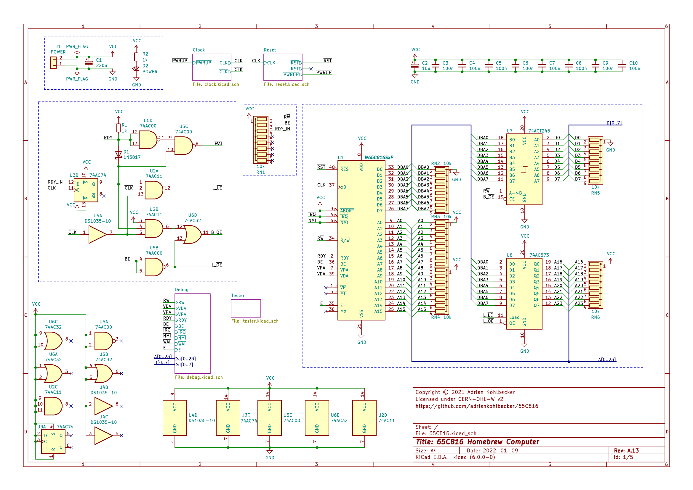
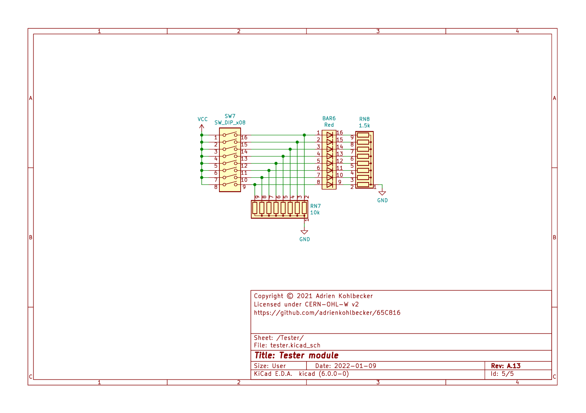

# 65C816

A homebrew computer based on the 65C816 processor. Watch the series on YouTube:

[](https://www.youtube.com/watch?v=sdFXc0Rkpvc&list=PLdGm_pyUmoII9D16mzw-XsJjHKi3f1kqT)

## Goals

The purpose of this project is to build a 65C816 development platform and learn about the CPU. Conceptually, it will be similar to WDC's [own development board](https://wdc65xx.com/Single-Board-Computers/w65c816sxb/).

I'm not going for ludicrous speed and features for revision A, here are the goals:

- Runs at 4Mhz
- Prototyped on a breadboard, through-hole ICs only, no programmable logic
- 32KB RAM, 32KB ROM, 512KB extended RAM
- 65C22 and 65C21 for peripheral I/O
- 65C51 for UART

The goals of the YouTube series are to provide a good description of all the design decisions, including going in-depth on timing, to be a more advanced complement to something like Ben Eater's 6502 series, as well as show more love to this cool CPU in the homebrew community.

## Schematic

### Top-level

[](./hardware/main.png)

### Clock module

[](./hardware/clock.png)

### Reset module

[](./hardware/reset.png)

### Debug module

[](./hardware/debug.png)

### Tester module

[](./hardware/tester.png)

## BOM

### Basics

- BusBoard BB830 Breadboards
- Hook-Up Wire: [Recommended option](https://www.jameco.com/z/JMS9313-01D-Jameco-Valuepro-22-AWG-6-Color-Solid-Tinned-Copper-Hook-Up-Wire-Assortment-100-Feet_2183752.html)
- Male-to-Male Dupont Wires
- [Dupont Female Connectors](https://www.aliexpress.com/item/4001362869482.html). Use them to replace single connectors and group your cables by 2, 8...
- 10uF Polarized capacitors. Sprinkle one per power rail
- 3mm LEDs with built-in resistors ([Yellow](https://www.digikey.com/product-detail/en/WP710A10YD5V/754-1729-ND/3084212), [Red](https://www.digikey.com/product-detail/en/WP710A10ID5V/754-1721-ND/3084187), [Green](https://www.digikey.com/product-detail/en/WP710A10SGD5V/754-1724-ND/3084201))
- LED Bars with 8 LEDs, various colors ([Red version](https://www.aliexpress.com/item/32315190808.html)), with [9-pin bussed 1k resistors](https://nl.mouser.com/ProductDetail/Bourns/4609M-101-102LF). I use 1k, 1.5k or 3.3k resistors depending on the color.

### KiCad components

**Component Count:** 119

| Refs | Qty | Component | Description |
| ----- | --- | ---- | ----------- |
| BAR1 | 1 | Blue | BAR GRAPH 8 segment |
| BAR2, BAR3, BAR4 | 3 | Yellow | BAR GRAPH 8 segment |
| BAR5 | 1 | Green | BAR GRAPH 8 segment |
| BAR6 | 1 | Red | BAR GRAPH 8 segment |
| C1 | 1 | 220u | Polarized capacitor, small symbol |
| C2, C16, C25, C31 | 4 | 10u | Polarized capacitor, small symbol |
| C3, C4, C5, C6, C7, C8, C9, C10, C17, C18, C19, C20, C21, C22, C23, C24, C26, C27, C28, C29, C30, C32, C33, C34, C35, C36, C37 | 27 | 100n | Unpolarized capacitor, small symbol |
| C11, C12, C13 | 3 | 2.2u | Polarized capacitor, small symbol |
| C14 | 1 | 1u | Polarized capacitor, small symbol |
| C15 | 1 | 10n | Unpolarized capacitor, small symbol |
| D1 | 1 | 1N5817 | 20V 1A Schottky Barrier Rectifier Diode, DO-41 |
| D2 | 1 | POWER | Light emitting diode, small symbol |
| D3 | 1 | Reset | Light emitting diode, small symbol |
| D4 | 1 | PWRUP | Light emitting diode, small symbol |
| D5 | 1 | Clock | Light emitting diode, small symbol |
| D6 | 1 | EMU | Light emitting diode, small symbol |
| J1 | 1 | POWER | Generic connector, single row, 01x02, script generated (kicad-library-utils/schlib/autogen/connector/) |
| R1, R2, R10, R11, R12, R13, R22 | 6 | 1k | Resistor, small symbol |
| R3, R5, R7 | 3 | 2.2k | Resistor, small symbol |
| R4, R6, R8, R14, R15, R16, R17, R18, R19, R20, R21 | 11 | 10k | Resistor, small symbol |
| R9 | 1 | 220 | Resistor, small symbol |
| RN1, RN2, RN3, RN4, RN5, RN6, RN7 | 7 | 10k | 8 resistor network, star topology, bussed resistors, small symbol |
| RN8, RN9 | 2 | 1.5k | 8 resistor network, star topology, bussed resistors, small symbol |
| RN10, RN11, RN12 | 3 | 1k | 8 resistor network, star topology, bussed resistors, small symbol |
| RN13 | 1 | 3.3k | 8 resistor network, star topology, bussed resistors, small symbol |
| RV1 | 1 | 500k | Potentiometer |
| SW1 | 1 | Pulse | Push button switch, generic, two pins |
| SW2 | 1 | Mode | Push button switch, generic, two pins |
| SW3 | 1 | Speed | Push button switch, generic, two pins |
| SW4 | 1 | SW_DIP_x04 | 4x DIP Switch, Single Pole Single Throw (SPST) switch, small symbol |
| SW5 | 1 | Reset | Push button switch, generic, two pins |
| SW6 | 1 | SW_DIP_SPDT_x02 | 2x DIP Switch, Single Pole Double Throw (SPDT) switch, small symbol |
| SW7 | 1 | SW_DIP_x08 | 8x DIP Switch, Single Pole Single Throw (SPST) switch, small symbol |
| U1 | 1 | W65C816SxP | W65C816S 8/16-bit CMOS General Purpose Microprocessor, DIP-40 |
| U2 | 1 | 74AC11 | Triple 3-input AND |
| U3 | 1 | 74AC74 | Dual D Flip-flop, Set & Reset |
| U4 | 1 | DS1035-10 | 3-in-1 High–Speed Silicon Delay Line |
| U5 | 1 | 74AC00 | quad 2-input NAND gate |
| U6 | 1 | 74AC32 | Quad 2-input OR |
| U7 | 1 | 74ACT245 | Octal BUS Transceivers, 3-State outputs |
| U8 | 1 | 74AC573 | 8-bit Latch 3-state outputs |
| U9 | 1 | 74HC14 | Hex inverter schmitt trigger |
| U10, U13 | 2 | 74HC112 | dual JK Flip-Flop, Set & Reset |
| U11, U14 | 2 | 74HC74 | Dual D Flip-flop, Set & Reset |
| U12 | 1 | LMC555xN | CMOS Timer, 555 compatible, PDIP-8 |
| U15 | 1 | 74HC193 | Synchronous 4-bit Up/Down (2 clk) counter |
| U16, U17 | 2 | 74HC151 | Multiplexer 8 to 1 |
| U18 | 1 | MAX705 | Low-Cost, μP Supervisory Circuit |
| U19 | 1 | 74HC175 | 4-bit D Flip-Flop, reset |
| U20 | 1 | 74HC04 | Hex Inverter |
| U21, U22, U23, U24, U25 | 5 | 74HC245 | Octal BUS Transceivers, 3-State outputs |
| X1 | 1 | 20MHz | Crystal Clock Oscillator, DIP14-style metal package |

### Used in previous videos

| Refs | Qty | Component | Description |
| ----- | --- | ---- | ----------- |
| U* | 1 | 74AC08 | Quad And2 |

### Replacement for obsolete chips

- `DS1035-10`: can be replaced by `DS1135Z-10+` with a SOIC-8 to through hole adapter

## Memory map

### Diagram

[](./doc/memory_map.png)

### Decoding

[](./doc/address_decoding.png)

### Decoding circuit

[](./simulation/address.png)

## Timing diagrams

### DB/BA Latch

<details><summary>View source</summary><p>

Uses [custom fork](https://github.com/adrienkohlbecker/wavedrom)

```js
{
  signal: [
    { name: 'CLK', wave: '1.0(50)1(50)0.', phase: 0.20 },
    { nodes: ['..Ѳ(10)Ѵ(40)Ά(10)Β', '...(7.5)Α(2.5)Γ(2.5)Ν(45)Ξ(2.5)Ο(2.5)Ό'], phase: 0.45 },
    { name: 'CLK+', wave: '1..(7.5)x(5)0(45)x(5)1..(37.5)', phase: 0.20 },
    { nodes: ['..B(33)Π', '..A(10)D(40)E(10)F(30)G(10)H'], phase: 0.45 },
    { name: 'CPU D0-D7 (read)', wave: '6..(10)x(23)7(27)x(30)6..(10)', data: ['Read Data', 'Bank Address', 'Read Data'], phase: 0.20 },
    { nodes: ['..K(33)C(17)Σ(30)I', '..Ρ(10)L(23)C(17)M(10)N'], phase: 0.45 },
    { name: 'CPU D0-D7 (write)', wave: '6(12)x(23)7(27)x(20)6(22)', data: ['Write Data', 'Bank Address', 'Write Data'], phase: 0.20 },
    { nodes: ['...(12.5)Я(8.5)P(29)Τ(7.5)S', '...(7.5)J(1)O..(39.5)Q(1)R'], phase: 0.45 },
    { name: 'AC573A LE', wave: '0..(8.5)x(12.5)1(30)x(6.5)0(44.5)', node: '..(49)É(3)È.(5.5)À(2)Ç', phase: 0.20, nphase: 0.45, nyoffset: -6 },
    { nodes: ['..(34)Υ(11.5)Z', '...(8.5)T(2)U(10.5)V(11)W(1)X(2)Y'], phase: 0.45 },
    { name: 'BA0-BA7', wave: '7..(10.5)x(21.5)=(3)x(9.5)7(57.5)', data: ['BA', 'Passthr.', 'Bank Address'], phase: 0.20 },
  ],
  edge: [
    'Ѳ+Ѵ 10ns', 'Α+Γ 2.5ns', 'Γ+Ν 2.5ns', 'Ά+Β 10ns', 'Ξ+Ο 2.5ns', 'Ο+Ό 2.5ns',
    'A+D 10ns', 'B+Π 33ns', 'E+F 10ns', 'G+H 10ns',
    'Ρ+L 10ns', 'K+C 33ns', 'M+N 10ns', 'Σ+I 30ns',
    'J+O 1ns', 'Я+P 8.5ns', 'Q+R 1ns', 'Τ+S 7.5ns',
    'T+U 2ns', 'V+W 11ns', 'X+Y 2ns', 'Υ+Z 11.5ns',
    'É+È 3ns', 'À+Ç 2ns',
  ],
  config: {
    skin: 'narrower',
    lines: {
      offset: 2,
      every: 50
    },
    background: 'white'
  },
  head: {
    tick: -2,
    every: 10,
    text: ['tspan', { "font-size": '12px' }, 'based on 10Mhz clock; assumes BE=RDY=1']
  }
}
```
</p></details>

[](./timing/Timing%20Latch.png)

### DB/BA Buffer

<details><summary>View source</summary><p>

Uses [custom fork](https://github.com/adrienkohlbecker/wavedrom)

```js
{
  signal: [
    { name: 'CLK', wave: '1.0(50)1(50)0.', phase: 0.20 },
    { nodes: ['..Ѳ(10)Ѵ(40)Ά(10)Β', '...(7.5)Α(2.5)Γ(2.5)Ν(45)Ξ(2.5)Ο(2.5)Ό'], phase: 0.45 },
    { name: 'CLK+', wave: '1..(7.5)x(5)0(45)x(5)1..(37.5)', phase: 0.20 },
    { nodes: ['..B(33)Π', '..A(10)D(40)E(10)F(30)G(10)H'], phase: 0.45 },
    { name: 'CPU D0-D7 (read)', wave: '6..(10)x(23)7(27)x(30)6..(10)', data: ['Read Data', 'Bank Address', 'Read Data'], phase: 0.20 },
    { nodes: ['..K(33)C(17)Σ(30)I', '..Ρ(10)L(23)C(17)M(10)N'], phase: 0.45 },
    { name: 'CPU D0-D7 (write)', wave: '6(12)x(23)7(27)x(20)6(22)', data: ['Write Data', 'Bank Address', 'Write Data'], phase: 0.20 },
    { nodes: ['..Ύ(30)Д', '..Б(10)Г'], phase: 0.45 },
    { name: 'ACT245 DIR', wave: '3..(10)x(20)3(70)..', data: ['RWB', 'RWB'], phase: 0.20 },
    { node: '...(10)Ё(1)Ж(19)З(12)И', phase: 0.45 },
    { name: 'ACT245 OUT', wave: '2..(11)x(31)2(58)..', data: ['DIR valid', 'DIR valid'], phase: 0.20 },
    { nodes: ['...(11)(2.5)І(17)Л(21.5)(11)(2.5)Ѣ(15)Ц', '...(7.5)Й(2)К(41.5)(7.5)П(2)Ф'], phase: 0.45 },
    { name: 'ACT245 OE', wave: '0..(9.5)x(20)1(30)x(18)0(22.5)..', data: ['RWB', 'RWB'], phase: 0.20 },
    { node: '...(9.5)Ч(1)Ш(19)Щ(11)Ъ(19)Ы(1.5)Ь(16.5)Э(12)Ю', phase: 0.45 },
    { name: 'ACT245 OUT', wave: '2..(10.5)x(30)2(20.5)x(28.5)2(10.5)..', data: ['ON', 'OFF', 'ON'], phase: 0.20 },
    { nodes: ['..Ε(10)Δ', '..(10)Φ(1)Έ(71)Ζ(9)Η(10)Ή'], phase: 0.45 },
    { name: 'D0-D7 (read)', wave: '6..(9)x(72)6(19)..', data: ['Read Data', 'Read Data'], phase: 0.20 },
    { node: '..Θ(10)Ι(1)Ί(39)Κ(30)Λ(9)Μ', phase: 0.45 },
    { name: 'D0-D7 (write)', wave: '6..(11)x(78)6(11)..', data: ['Write Data', 'Write Data'], phase: 0.20 },
  ],
  edge: [
    'Ѳ+Ѵ 10ns', 'Α+Γ 2.5ns', 'Γ+Ν 2.5ns', 'Ά+Β 10ns', 'Ξ+Ο 2.5ns', 'Ο+Ό 2.5ns',
    'A+D 10ns', 'B+Π 33ns', 'E+F 10ns', 'G+H 10ns',
    'Ρ+L 10ns', 'K+C 33ns', 'M+N 10ns', 'Σ+I 30ns',
    'Б+Г 10ns', 'Ύ+Д 30ns',
    'Ё+Ж 1ns', 'З+И 12ns',
    'Й+К 2ns', 'І+Л 17ns', 'П+Ф 2ns', 'Ѣ+Ц 15ns',
    'Ч+Ш 1ns', 'Щ+Ъ 11ns', 'Ы+Ь 1.5ns', 'Э+Ю 12ns',
    'Ε+Δ 10ns', 'Φ+Έ 1ns', 'Ζ+Η 9ns', 'Η+Ή 10ns',
    'Θ+Ι 10ns', 'Ι+Ί 1ns', 'Κ+Λ 30ns', 'Λ+Μ 9ns'
  ],
  config: {
    skin: 'narrower',
    lines: {
      offset: 2,
      every: 50
    },
    background: 'white'
  },
  head: {
    tick: -2,
    every: 10,
    text: ['tspan', { "font-size": '12px' }, 'based on 10Mhz clock; assumes BE=RDY=1']
  }
}
```
</p></details>

[](./timing/Timing%20Buffer.png)

### Address decoding

<details><summary>View source</summary><p>

Uses [custom fork](https://github.com/adrienkohlbecker/wavedrom)

```js
{
  signal: [
    { name: 'CLK', wave: '1.0(100)1.', phase: 0.20 },
    { nodes: ['..Ѳ(30)Ѵ', '..Α(10)Γ'], phase: 0.45 },
    { name: 'A[0..15]', wave: '3..(10)x(20)3(70)..', data: ['', 'Address'], phase: 0.20 },
    { nodes: ['..Β(44.5)Ξ', '..Ν(10.5)Ά'], phase: 0.45 },
    { name: 'A[16..23]', wave: '7..(10.5)x(34)7(57.5)', data: ['', 'Bank Address'], phase: 0.20 },
    { nodes: ['..Ο(75.5)Ό', '..A(11.5)D'], phase: 0.45 },
    { name: 'EXTRAM_CS', wave: '8..(11.5)x(64)8(26.5)', data: ['', 'Extended RAM'], phase: 0.20 },
    { nodes: ['..B(76.5)Π', '..E(11)F'], phase: 0.45 },
    { name: 'ROM_CS', wave: '8..(11)x(65.5)8(25.5)', data: ['', 'ROM'], phase: 0.20 },
    { nodes: ['..G(78.5)H', '..Ρ(12.5)L'], phase: 0.45 },
    { name: 'IO_CS', wave: '8..(12.5)x(66)8(23.5)', data: ['', 'I/O'], phase: 0.20 },
    { nodes: ['..K(76.5)C', '..M(11)N'], phase: 0.45 },
    { name: 'RAM_CS', wave: '8..(11)x(65.5)8(25.5)', data: ['', 'RAM'], phase: 0.20 },
  ],
  edge: [
    'Ѳ+Ѵ 30ns', 'Α+Γ 10ns', 'Ν+Ά 10.5ns', 'Β+Ξ 44.5ns', 'Ο+Ό 75.5ns',
    'A+D 11.5ns', 'B+Π 76.5ns', 'E+F 11ns', 'G+H 78.5ns',
    'Ρ+L 12.6ns', 'K+C 76.5ns', 'M+N 11ns',
  ],
  config: {
    skin: 'narrower',
    lines: {
      offset: 2,
      every: 100
    },
    background: 'white'
  },
  head: {
    tick: -2,
    every: 10,
    text: ['tspan', { "font-size": '12px' }, 'based on 5Mhz clock; assumes BE=RDY=1']
  }
}
```
</p></details>

[](./timing/Timing%20Address.png)

### Bus Enable

<details><summary>View source</summary><p>

Uses [custom fork](https://github.com/adrienkohlbecker/wavedrom)

```js
{
  signal: [
    { name: 'BE', wave: '1....0(32)', phase: 0.20 },
    { nodes: ['.....Ѳ(25)Ѵ'], phase: 0.45 },
    { name: 'CPU ADDR & RWB', wave: '7....x(25)9(7)', data:['ON', 'OFF'], phase: 0.20 },
    { nodes: ['.....Ά(8.5)Ν', '.....Α(1.5)Γ'], phase: 0.45 },
    { name: 'AC573 OE', wave: '0.....(1.5)x(7)1(23.5)', data:['ON', 'OFF'], phase: 0.20 },
    { nodes: ['......(8.5)Β(12)Ξ', '......(1.5)Ο(2)Ό'], phase: 0.45 },
    { name: 'AC573 OUT', wave: '7.....(3.5)x(17)9(11.5)', data:['ON', 'OFF'], phase: 0.20 },
    { nodes: ['.....A(17)D', '.....B(2.5)Π'], phase: 0.45 },
    { name: 'ACT245 OE', wave: '0.....(2.5)x(14.5)1(15)', data:['ON', 'OFF'], phase: 0.20 },
    { nodes: ['......(17)E(11)F', '......(2.5)G(1)H'], phase: 0.45 },
    { name: 'ACT245 OUT', wave: '7.....(3.5)x(24.5)9(4)', data:['ON', 'OFF'], phase: 0.20 },
    {},
    {},
    { name: 'BE', wave: '0....1(32)', phase: 0.20 },
    { nodes: ['.....Ρ(25)L'], phase: 0.45 },
    { name: 'CPU ADDR & RWB', wave: '9....x(25)7(7)', data:['OFF', 'ON'], phase: 0.20 },
    { nodes: ['.....M(7)N', '.....K(1)C'], phase: 0.45 },
    { name: 'AC573 OE', wave: '1.....(1)x(6)0(25)', data:['ON', 'OFF'], phase: 0.20 },
    { nodes: ['......(7)J(10)O', '......(1)Σ(2)I'], phase: 0.45 },
    { name: 'AC573 OUT', wave: '9.....(3)x(14)7(15)', data:['OFF', 'ON'], phase: 0.20 },
    { nodes: ['.....Q(14.5)R', '.....Я(2)P'], phase: 0.45 },
    { name: 'ACT245 OE', wave: '1.....(2)x(12.5)0(17.5)', data:['ON', 'OFF'], phase: 0.20 },
    { nodes: ['......(14.5)T(12)U', '......(2)Τ(1.5)S'], phase: 0.45 },
    { name: 'ACT245 OUT', wave: '9.....(3.5)x(23)7(5.5)', data:['OFF', 'ON'], phase: 0.20 },
  ],
  edge: [
    'Ѳ+Ѵ 25ns', 'Α+Γ 1.5ns', 'Ά+Ν 8.5ns', 'Ο+Ό 2ns', 'Ξ+Β 12ns',
    'B+Π 2.5ns', 'A+D 17ns', 'G+H 1ns','E+F 11ns',
    'Ρ+L 25ns', 'K+C 1ns', 'M+N 7ns', 'Σ+I 2ns', 'J+O 10ns',
    'Я+P 2ns', 'Q+R 14.5ns', 'Τ+S 1.5ns','T+U 12ns',
  ],
  config: {
    skin: 'narrower',
    lines: {
      offset: 5,
      every: 50
    },
    background: 'white'
  },
  head: {
    tick: -5,
    every: 10,
    text: ['tspan', { "font-size": '12px', dx: 20 }, 'timing of Bus Enable; assumes CLK=RDY=1']
  }
}
```
</p></details>

<a href="./timing/Timing%20BE.png"></a>

### RDY

<details><summary>View source</summary><p>

Uses [custom fork](https://github.com/adrienkohlbecker/wavedrom)

```js
{
  signal: [
    { name: 'CLK', wave: '1.0(50)1(50)0.', phase: 0.20 },
    { nodes: ['...(47)Ξ(3)Ο(0.5)Ό'], phase: 0.45 },
    { name: 'RDY_IN', wave: 'z..(47)6(3.5)z(51.5)', data: ['IN'], phase: 0.20 },
    { nodes: ['...(50)B(10.5)Π', '...(50)E(2.5)F'], phase: 0.45 },
    { name: 'RDY (registered)', wave: '4..(52.5)x(8)4(41.5)', data: ['RDY (reg)', 'RDY (reg)'], phase: 0.20 },
    { nodes: ['...(60.5)Σ(30)I'], phase: 0.45 },
    { name: 'RDY', wave: '3..(52.5)x(38)3(11.5)', data: ['RDY', 'RDY'], phase: 0.20 },
    { nodes: ['..Ύ(10)Д(80)Ё(10)Ж'], phase: 0.45 },
    { name: 'RDY (cpu in)', wave: '6..(10)z(80)6(12)', data: ['RDY', 'RDY'], phase: 0.20 },
  ],
  edge: [
    'Ξ+Ο 3ns', 'Ο+Ό .5ns',
    'B+Π 10.5ns', 'E+F 2.5ns',
    'Σ+I 30ns',
    'Ύ+Д 10ns', 'Ё+Ж 10ns',
  ],
  config: {
    skin: 'narrower',
    lines: {
      offset: 2,
      every: 50
    },
    background: 'white'
  },
  head: {
    tick: -2,
    every: 10,
    text: ['tspan', { "font-size": '12px' }, 'based on 10Mhz clock; assumes BE=1']
  }
}
```
</p></details>

[](./timing/Timing%20RDY.png)
